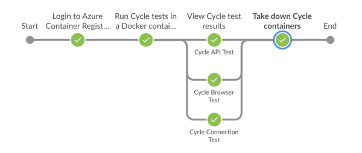
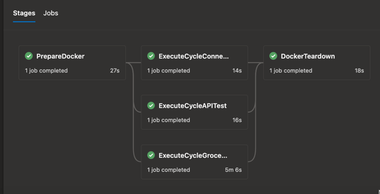

# Cycle as a Docker container
The Cycle execution service has been turned into a Docker container that can be easily spun up to execute headless Cycle features. This removes the need to build virtual machines that can take a long time to be created, configured, and then checked into your Jenkins (or Azure DevOps) infrastructure.

## Architecture Considerations
This container was built using an Ubuntu virtual machine because it is running on environments that used Ubuntu based agents. We also built one for use on M1 based MacBooks (right now, that's just the `cycle:0:0:0` one). There may be a need to run `docker build` on the `Dockerfile` and rebuild this container on the appropriate OS architecture if using it elsewhere.

```
  image: "cycledev.azurecr.io/cycledev/cycle:0.0.2" ## MacBook M1
  image: "cycledev.azurecr.io/cycledev/cycle-ubu:0.0.3" ## Ubuntu
```
# Using Docker to run Cycle tests - the TLDR

I want to take some time to explain how the architecture we've started to develop functions. This is the very TLDR version of this and will without a doubt change as we progress. The goal of this is to help you fundamentally understand how and why this works.

#### Spinning up the Docker infrastructure
In the root of the repository, there is a `docker-compose.yml` file. This file includes all of the necessary containers that we want to build to power our Dockerized Cycle tests. This file is used to orchestrate the creation of the the environment that is written out within it. We use the command `docker-compose up` to invoke Docker to build out the containers that are specified within the file. In our pipeline, we spin up the containers, run our tests, and then tear down the containers. 

```
# Since we use secrets, we first build the container with the secrets baked into it so they can be used in our feature file
docker-compose build --build-arg pw_oracle_db='$PW_ORACLE_DB' --build-arg pw_sql_db='$PW_SQL_DB' --build-arg pw_sql14_db='$PW_SQL14_DB' --build-arg pw_db2='$PW_DB2' --build-arg pw_mysql='$PW_MYSQL' --build-arg pw_telnet='$PW_TELNET' --build-arg pw_openssh='$PW_OPENSSH' --build-arg pw_moca='$PW_MOCA' --build-arg pw_azuresql='$PW_AZURESQL' --detach --verbose
# We then spin the containers up and start our test execution
docker-compose up -d --remove-orphans
# Finally, we tear down everything.
docker-compose down -v
```


#### Executing a Cylce test with the Docker containers
Right now, the best practice is spinning up the Cycle containers and passing through a feature file for them to execute on startup. You can start more than one in a `docker-compose.yml` file and then run your tests in parallel. Eventually, it would be nice to spin the container up as more of a true daemon, and just send features to it to execute in various steps. 

An example of features being ran using the `docker-compose.yml` are below, in the `command:` property. You can see we pass through various `.feature` files in and right as the container spins up, it executes them. 

- In the `cycle-connection-test` container, we also inject some environment variables (secrets) that are needed for the feature to run.
- In the `cycle-browser-test` container, we also have a depdency on other containers that we are spinning up to perform web tests. This makes the container wait on the other containers to start and be ready, before starting up.

```
  cycle-connection-test:
    image: "cycledev.azurecr.io/cycledev/cycle-ubu:0.0.3"
    volumes:
      - .:/code
    environment:
      WAIT_HOSTS: chrome:4444
      PW_ORACLE_DB: ${PW_ORACLE_DB}
      PW_SQL_DB: ${PW_SQL_DB}
      PW_DB2: ${PW_DB2}
      PW_MYSQL: ${PW_MYSQL}
      PW_SQL14_DB: ${PW_SQL14_DB}
      PW_TELNET: ${PW_TELNET}
      PW_MOCA: ${PW_MOCA}
      PW_AZURESQL: ${PW_AZURESQL}
      PW_OPENSSH: ${PW_OPENSSH}
    depends_on:
      - "chrome"
    command: bash -c "/wait && /home/cycle/cycle-cli -p /code combined/conf-file-cycle-connection-test.feature"
  cycle-api-test:
    image: "cycledev.azurecr.io/cycledev/cycle-ubu:0.0.3"
    volumes:
      - .:/code
    command: bash -c "/wait && /home/cycle/cycle-cli -p /code combined/api-test.feature"
  cycle-browser-test:
    image: "cycledev.azurecr.io/cycledev/cycle-ubu:0.0.3"
    volumes:
      - .:/code
    depends_on:
      - "chrome"
      - "edge"
      # - "firefox"
    command: bash -c "/wait && /home/cycle/cycle-cli -p /code combined/browser-test.feature"
```
#### Looking at the output for Cycle tests
Since each test is running inside of its own Docker container in parallel, we use the `docker logs` command to print out the output of our Cycle test. This way we can view each indivdual tests logs in its own step, and read the print out to make sure our test is functioning the way we want it to.

```
    stage('View Cycle test results') {
      parallel {
          stage('Cycle Connection Test') {
            steps{
                sh "docker-compose logs -f cycle-connection-test"
            }
            }
          stage('Cycle API Test') {
            steps{
                sh "docker-compose logs -f cycle-api-test"
            }
            }
          stage('Cycle Browser Test') {
            steps{
                sh "docker-compose logs -f cycle-browser-test"
            }
            }
      }
    }
```
#### Taking down the Docker infrastructure
Once all of our testing is down, to clean up our Docker infrastructure we want to stop all of the containers. We can do this by running a command like: `docker-compose down -v`

This way the next time we go to spin back up our environment, it's a clean slate to test against.

## Utilizing the Cycle Docker container within a Jenkins pipeline
The biggest value proposition of this is the ability to more easily integrate these serverless containers into your pipeline. It reduces the complexity because for the most part, we are able to do without actual VM agents and can just spin up a Docker compose file to run all of the containers and services we need to perform tests on the Jenkins manager itself, without having to have tools and software installed and configured - since all of the requirements exist within the containers that Docker is spinning up. It should be noted that since containers have no GUI, they are restricted to executing headless tests only. 

**Note**: There may be requirements that need headed tests where these Docker containers would not make sense to use.

### Jenkinsfile



The steps below will walk you through how to construct a Jenkins pipeline to run Cycle tests within a Docker environment. The TLDR; version of how the `Jenkinsfile` in this repository works is:

1. Login to the repository that holds the Cycle Docker image (this will probably be on a public repository we move more into production)
2. Obtain any secrets we need from our secret manager (Jenkins credentials, Azure KeyVault, etc)
3. Bake the secrets into the image with `docker build`
4. Use `docker-compose up` to orchestrate our containers to spin up in daemon mode, using the `-d` argument.
5. View our test results using `docker logs`
6. Tear down our containers with `docker-compose down`

The majority of a working `Jenkinsfile` is below, where we do all of the above steps. 

```
  stages {
    stage('Login to Azure Container Registry') {
          environment {
            PW_CYCLEDEV_ACR = credentials('cycledev-acr-pw')
          }
      steps {
        sh "docker login cycledev.azurecr.io -u cycledev -p $pw_cycledev_acr"
      }
    }
    stage('Run Cycle tests in a Docker container') {
          environment {
            PW_ORACLE_DB = credentials('oracle-db-pw')
            PW_SQL_DB = credentials('sql-db-pw')
            PW_SQL14_DB = credentials('sql14-db-pw')
            PW_DB2 = credentials('db2-db-pw')
            PW_MYSQL = credentials('mysql-db-pw')
            PW_TELNET = credentials('telnet-pw')
            PW_OPENSSH = credentials('openssh-pw')
            PW_MOCA = credentials('moca-pw')
            PW_AZURESQL = credentials ('azuresql-pw')
          }
          steps {
            sh "docker-compose build --build-arg pw_oracle_db='$PW_ORACLE_DB' --build-arg pw_sql_db='$PW_SQL_DB' --build-arg pw_sql14_db='$PW_SQL14_DB' --build-arg pw_db2='$PW_DB2' --build-arg pw_mysql='$PW_MYSQL' --build-arg pw_telnet='$PW_TELNET' --build-arg pw_openssh='$PW_OPENSSH' --build-arg pw_moca='$PW_MOCA' --build-arg pw_azuresql='$PW_AZURESQL' --detach --verbose"
            sh "docker-compose up -d --remove-orphans"
        }
    }
    stage('View Cycle test results') {
      parallel {
          stage('Cycle Connection Test') {
            steps{
                sh "docker-compose logs -f cycle-connection-test"
            }
            }
          stage('Cycle API Test') {
            steps{
                sh "docker-compose logs -f cycle-api-test"
            }
            }
          stage('Cycle Browser Test') {
            steps{
                sh "docker-compose logs -f cycle-browser-test"
            }
            }
      }
    }
    stage('Take down Cycle containers') {
          steps{
                sh "docker-compose down -v"
          }
    }
```

### Utilizing the Cycle Docker container with an Azure DevOps Pipeline
In the same way you can use Jenkins to make use of the Cycle Docker container, you can use Azure DevOps. In the example below I am using a self-hosted Agent Pool (Ubuntu 22.04) to run my test on an hourly basis. The **big** different with Azure DevOps vs Jenkins, is that agents can only one run step/job at a time, so if you want to run 3 Cycle tests in parallel, you'd need 3 agents online to do so. 




An example `azure-pipelines.yml` file is shown below. I basically took the same steps that were running in the Jenkins pipeline, and retrofitted them in an Azure DevOps Pipeline which uses an entirely different syntax. This is just an idea to get you started.

```
trigger:
  - master

schedules:
  - cron: "10 * * * *"
    displayName: Every Hour Regression Test
    always: true
    branches:
      include:
        - master

pool: "Cycle2xPipelines"

stages:
  - stage: PrepareDocker
    jobs:
      - job: PrepareDocker
        displayName: Prepare Docker
        steps:
          - task: AzureKeyVault@2
            inputs:
              azureSubscription: "Cycle Labs - Development (WIF)"
              KeyVaultName: "kv-development-5itM"
              SecretsFilter: "PW-CYCLEDEV-ACR, PW-DB2, PW-MOCA, PW-MYSQL, PW-ORACLE-DB, PW-SQL-DB, PW-SQL14-DB, PW-TELNET, PW-OPENSSH, PW-AZURESQL"
              RunAsPreJob: true

          - script: |
              docker login cycledev.azurecr.io -u cycledev -p $(PW-CYCLEDEV-ACR)
            failOnStderr: false
            displayName: "Pipeline Info"
            env:
              PW-CYCLEDEV-ACR: $(PW-CYCLEDEV-ACR)

          - script: |
              docker-compose build --build-arg pw_oracle_db='$PW_ORACLE_DB' --build-arg pw_sql_db='$PW_SQL_DB' --build-arg pw_sql14_db='$PW_SQL14_DB' --build-arg pw_db2='$PW_DB2' --build-arg pw_mysql='$PW_MYSQL' --build-arg pw_telnet='$PW_TELNET' --build-arg pw_openssh='$PW_OPENSSH' --build-arg pw_moca='$PW_MOCA' --build-arg pw_azuresql='$PW_AZURESQL' --detach --verbose

              docker-compose up -d --remove-orphans
            failOnStderr: false
            displayName: "Build Docker environment"
            env:
              PW_DB2: $(PW-DB2)
              PW_MOCA: $(PW-MOCA)
              PW_MYSQL: $(PW-MYSQL)
              PW_OPENSSH: $(PW-OPENSSH)
              PW_ORACLE_DB: $(PW-ORACLE-DB)
              PW_SQL_DB: $(PW-SQL-DB)
              PW_SQL14_DB: $(PW-SQL14-DB)
              PW_TELNET: $(PW-TELNET)
              PW_AZURESQL: $(PW-AZURESQL)

  - stage: ExecuteCycleConnectionTest
    dependsOn: PrepareDocker
    jobs:
      - job: ExecuteCycleConnectionTest
        displayName: ExecuteCycleConnectionTest
        steps:
          - script: |
              docker-compose logs -f cycle-connection-test
            failOnStderr: false
            displayName: "Logs for Cycle Connection Test"
            env:
              PW_DB2: $(PW-DB2)
              PW_MOCA: $(PW-MOCA)
              PW_MYSQL: $(PW-MYSQL)
              PW_OPENSSH: $(PW-OPENSSH)
              PW_ORACLE_DB: $(PW-ORACLE-DB)
              PW_SQL_DB: $(PW-SQL-DB)
              PW_SQL14_DB: $(PW-SQL14-DB)
              PW_TELNET: $(PW-TELNET)
              PW_AZURESQL: $(PW-AZURESQL)

  - stage: ExecuteCycleAPITest
    dependsOn: PrepareDocker
    jobs:
      - job: ExecuteCycleAPITest
        displayName: ExecuteCycleAPITest
        steps:
          - script: |
              docker-compose logs -f cycle-api-test
            failOnStderr: false
            displayName: "Logs for Cycle API Test"

  - stage: ExecuteCycleGrocerIOTest
    dependsOn: PrepareDocker
    jobs:
      - job: ExecuteCycleGrocerIOTest
        displayName: ExecuteCycleGrocerIOTest
        steps:
          - script: |
              docker-compose logs -f cycle-browser-test
            failOnStderr: false
            displayName: "Logs for Cycle Browser Test"

  - stage: DockerTeardown
    dependsOn: 
      - ExecuteCycleConnectionTest
      - ExecuteCycleGrocerIOTest
      - ExecuteCycleAPITest
    jobs:
      - job: TeardownDocker
        displayName: TeardownDocker
        steps:
          - script: |
              docker-compose down -v
            failOnStderr: false
            displayName: "Tear down docker infrastructure"
            condition: always() # this step will always run, even if the pipeline is canceled
```
### Using Selenium Standalone Browsers for Cycle browser tests

Stuff will go here... soon.

### Using Remote WinApp Driver steps

Stuff will go here... soon.

# Intro To Config Files

This example Cycle project includes some example use cases of utilizing .conf files in your features.

**Note:** To download this project and run the examples it contains, be sure to set the path in your project settings for your Chrome driver location.

## secrets

This is a simple example where credentials are handled in a .conf file rather than being hard-coded in a .feature or .csv file.  In the default.conf file,
there are just the following entries:
```hocon
username = ${GROCER_USER}
password = ${GROCER_PASS}
```
These can be set by having a GROCER_USER and GROCER_PASS environment variable set when Cycle is run. Or utilizing a local.conf file will allow you to 
provide values locally which aren't committed to any code repository. The feature in the secrets folder demonstrates how this works.

## parameterizedTest

This is an example where a default value is included for a parameter (the url used in the test, in this example), and it also allows for that value to be
overridden at run time via an environment variable. This would allow a team to parameterize their tests and inject different values at run time, such as
when executing a test in a CI/CD pipeline. You may want to inject a QA vs Dev environment values or maybe a different warehouse ID, for example.
```hocon
grocer_url = "https://cyclelabs.io/playground"
grocer_url = ${?GROCER_URL}
```
This example also moves locators out of the feature and into a config file.  This may be useful where the steps are the same, but locators may change
from one version of an application to the next.

## layeringConfigData

This is an example of having being able to inject different configuration values for different environments while keeping the feature short and without
having to update the feature to run with different configurations. In this example, we are entering an order in the grocer.io application. In the
default.conf file, we have the test data, which includes the price in USD. We also have ca.conf, euro.conf, and yuan.conf which include the test data
from default.conf and overrides the price in a variety of other currencies. In the env.conf, we define the default amongst these to use in the test.
This can be overridden in a local.conf or by setting an ENV_FILE environment variable, so we can easily run the test using a variety of currencies without
having to make any changes to the example.

## combined

In this example, we show a more complete example which combines a variety of the use cases from the previous example. We cleanly separate credential data
from test data (the order entry data in a variety of currencies) from application data (the locators for the web application). In this example we try
to provide an example of how to create a simple, readable, dynamic feature with easy to maintain data.

## sharedConfigData

The previous examples were all intended to be stand alone examples. Thus some config data, like the entries for login credentials,
have been duplicated across each of the folders. But this only for the sake of having isolated examples, and is not required when
using config files.  In this example, I'll show what it would look like when resusable config entries are abstracted out into a
root folder and shared amongst multiple sub folders. The reusable pageObject.conf and credentials.conf file are in the root of this example,
the sharedConfigData folder. The default.conf file in the parameterizedTest subdirectory refer to these files in the root.  Likewise, the env.conf
file in the combined subdirectory refer to the same pageObject.conf and credentials.conf in the root sharedConfigData folder.
The syntax these files use to refer to the config files in the parent directory is as follows.
```hocon
include "../credentials.conf"
include "../pageObjects.conf"
```

## Important Note
When the data in your config file is stuctured, such as in either of these examples:
```hocon
wms {
  url = "https://cyclelabs.io/playground"
  user = ${WMS_USER}
  pass = ${WMS_PASS}
}
wms.user = SUPER
```
the created cycle variables will separate the keys with an underscore. So in the above example, you would have three cycle variables:
wms_url, wms_user, and wms_pass.

## Additional Information
These examples provide just a brief introduction into how you can structure your data utilizing the config files.
For more information on other ways to to structure your test data in config files, please see the documentation
page for the [Human Optimized Config Object Notation](https://github.com/lightbend/config/blob/main/HOCON.md) format.

